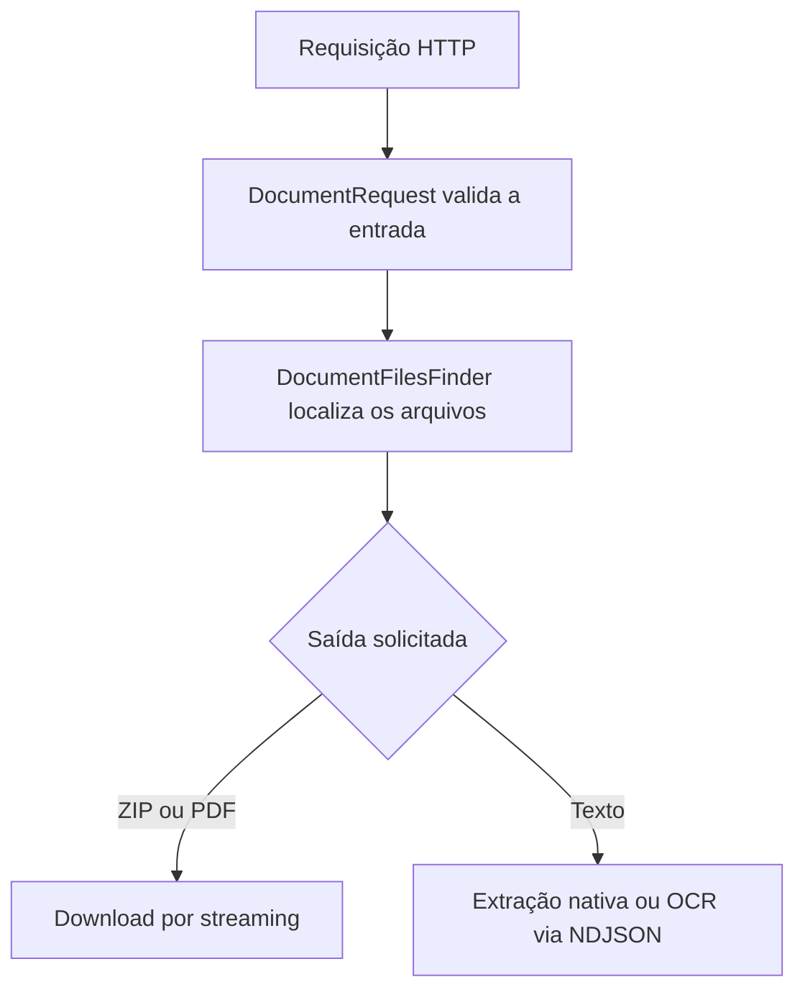

<div align="center">

# BaixaRI Backend

API em Node.js e TypeScript para localizar, reunir e extrair texto de documentos organizados por número de protocolo ou certidão.


[Frontend](https://github.com/marcosfrancomarinho/baixari) · [Endpoints](#endpoints) · [Execução](#instalação-e-execução)

</div>

## Sobre o projeto

O backend do **BaixaRI** consulta pastas de protocolos e certidões e entrega o conteúdo no formato adequado para cada necessidade:

- **ZIP** com todos os arquivos encontrados;
- **PDF único** formado por PDFs e imagens;
- **texto progressivo** para o frontend gerar arquivos DOCX.

Quando um documento não possui texto nativo, a API renderiza a página e aplica OCR em português com Tesseract. Todo o processamento ocorre localmente: os documentos não são enviados a serviços externos.

## Funcionalidades

- consulta de protocolos e certidões pelo número;
- leitura recursiva de pastas e subpastas em ordem numérica;
- compactação ZIP com streaming e nível máximo de compressão;
- união de PDFs e imagens JPG, JPEG e PNG;
- extração do texto nativo de PDFs;
- OCR local de PDFs digitalizados, páginas mistas e imagens;
- resposta progressiva em `application/x-ndjson`;
- cancelamento do processamento quando o cliente encerra a conexão;
- controle de fluxo para clientes lentos;
- validações centralizadas no objeto imutável `DocumentRequest`;
- tratamento HTTP unificado para erros de validação, ausência de documentos e falhas internas;
- separação entre aplicação, infraestrutura e apresentação;
- estratégias independentes para as saídas ZIP e PDF;
- testes automatizados com o test runner nativo do Node.js.

## Fluxo da aplicação



## Endpoints

| Método | Rota | Retorno |
|---|---|---|
| `GET` | `/protocol/:number?format=zip` | protocolo compactado em ZIP |
| `GET` | `/protocol/:number?format=pdf` | protocolo reunido em um único PDF |
| `GET` | `/certificate/:number?format=zip` | certidão compactada em ZIP |
| `GET` | `/certificate/:number?format=pdf` | certidão reunida em um único PDF |
| `GET` | `/protocol/:number/text` | páginas do protocolo em NDJSON |
| `GET` | `/certificate/:number/text` | páginas da certidão em NDJSON |

O parâmetro `format` é opcional nos endpoints de download e assume `zip` por padrão. O backend aceita apenas `zip` ou `pdf`; o DOCX é gerado pelo [frontend](https://github.com/marcosfrancomarinho/baixari) após receber o texto progressivo.

### Formatos processados

| Saída | Arquivos considerados | Comportamento |
|---|---|---|
| ZIP | qualquer arquivo | preserva todo o conteúdo da pasta |
| PDF | PDF, JPG, JPEG e PNG | combina tudo em um único documento |
| Texto | PDF, JPG, JPEG e PNG | usa texto nativo e OCR quando necessário |

Arquivos sem formato compatível são ignorados nas saídas PDF e texto. Se nenhum arquivo válido for encontrado, a API retorna `404`.

### Eventos da extração progressiva

Cada linha da resposta é um objeto JSON independente:

```json
{"type":"start"}
{"type":"page","file":"documento.pdf","page":1,"totalPages":2,"text":"Texto da primeira página"}
{"type":"page","file":"documento.pdf","page":2,"totalPages":2,"text":"Texto da segunda página"}
{"type":"done","pages":2}
```

Se ocorrer uma falha depois do início do stream, a última linha terá o formato:

```json
{"type":"error","error":"Descrição da falha"}
```

## Arquitetura

```text
src/
├── app/
│   ├── contracts/       # portas para filesystem, ZIP, PDF e extração
│   ├── errors/          # erros da aplicação
│   ├── factory/         # seleção da estratégia de saída
│   ├── model/           # modelos de dados
│   ├── request/         # validação e normalização da entrada
│   ├── services/        # localização dos documentos
│   ├── strategy/        # geração de ZIP ou PDF
│   └── usecase/         # coordenação dos fluxos
├── di/                  # configuração das dependências
├── infra/               # filesystem, Archiver, pdf-lib e Tesseract
├── presentation/
│   ├── controllers/     # adaptação HTTP
│   ├── http/            # respostas de erro
│   └── routers/         # definição das rotas
└── main.ts              # inicialização da aplicação
```

### Decisões principais

- `DocumentRequest` é a fronteira única de validação e normalização.
- `DocumentFilesFinder` conhece a busca no sistema de arquivos, mas não gera respostas.
- Os casos de uso coordenam dependências sem conhecer Express ou detalhes concretos.
- `DownloadOutputStrategyFactory` escolhe a estratégia ZIP ou PDF.
- Controllers cuidam somente do protocolo HTTP, headers, streaming e erros.

## Configuração

Antes de executar, defina as pastas-base em `src/di/providers.ts`:

- `PATH_PROTOCOL`: diretório que contém os pedidos de protocolo;
- `PATH_CERTIFICATE`: diretório que contém os pedidos de certidão.

A estrutura esperada é uma subpasta para cada número:

```text
<pasta-base>/
└── 123/
    ├── documento.pdf
    └── anexos/
        └── imagem.jpg
```

A porta pode ser definida pela variável de ambiente `PORT`; o valor padrão é `3000`.

## Instalação e execução

### Requisitos

- Node.js `22.13` ou superior;
- npm ou Yarn;
- acesso de leitura às pastas configuradas.

```bash
git clone https://github.com/marcosfrancomarinho/baixari-backend.git
cd baixari-backend
npm install
npm run dev
```

Para gerar e executar o build de produção:

```bash
npm run build
npm start
```

### Scripts

| Comando | Descrição |
|---|---|
| `npm run dev` | inicia o servidor em modo de desenvolvimento |
| `npm run build` | gera `dist/bundle.cjs` com esbuild |
| `npm start` | executa o bundle de produção |
| `npm run type` | acompanha a verificação de tipos em modo watch |

## Testes

```bash
node --import tsx --test tests/*.test.ts
npm run build
```

Os testes cobrem validações, localização de arquivos, downloads, extração de texto, streaming NDJSON e cancelamento.

## Observações

- A união de PDFs gera um novo documento e não preserva assinaturas digitais dos arquivos originais.
- A precisão do OCR depende da resolução e da legibilidade da página; revise o texto reconhecido.
- Para preservar a resposta progressiva atrás de um proxy, desative o buffering e configure um timeout compatível com páginas mais lentas.

## Licença

MIT, conforme declarado no `package.json`.

## Autor

Desenvolvido por [Marcos Marinho](https://github.com/marcosfrancomarinho).
