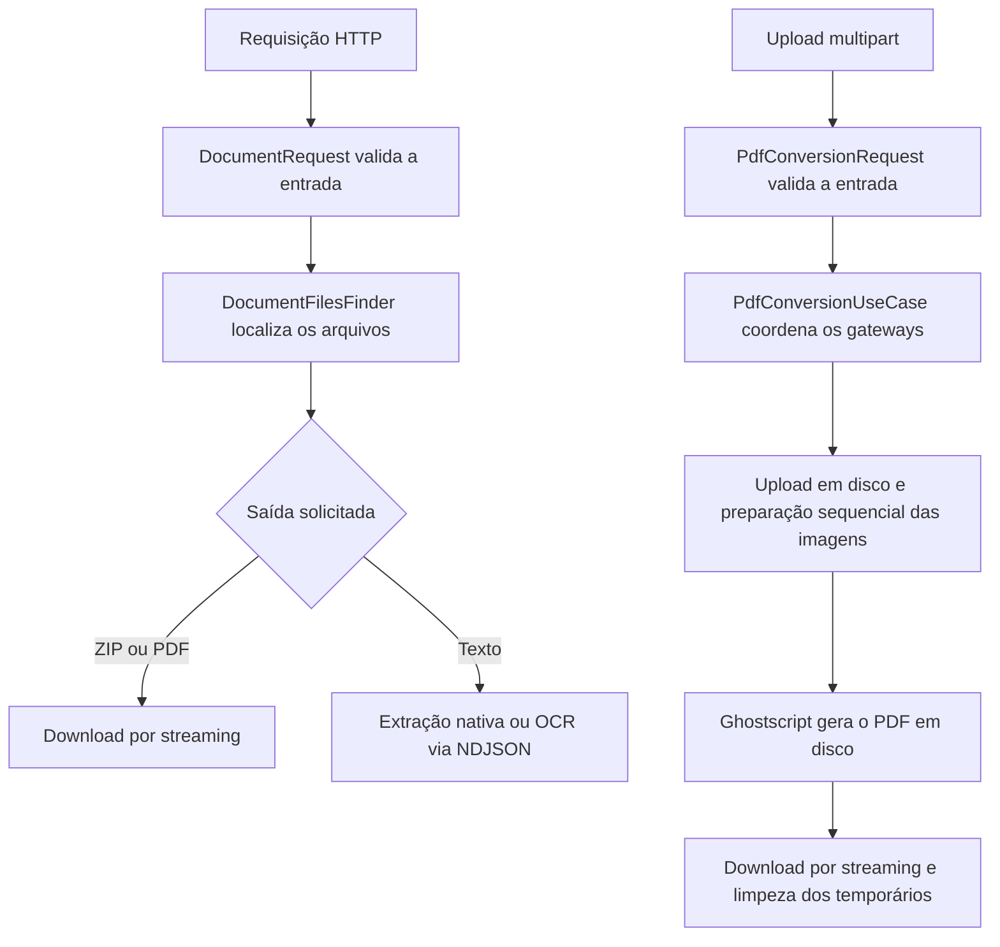

<div align="center">

# BaixaRI Backend

API em Node.js e TypeScript para consultar documentos por protocolo ou certidão, extrair texto e converter imagens e PDFs enviados por upload em um PDF único.


[Frontend](https://github.com/marcosfrancomarinho/baixari) · [Endpoints](#endpoints) · [Execução](#instalação-e-execução) · [Manutenção](docs/code-organization.md)

</div>

## Sobre o projeto

O backend do **BaixaRI** consulta pastas de protocolos e certidões e entrega o conteúdo no formato adequado para cada necessidade:

- **ZIP** com todos os arquivos encontrados;
- **PDF único** formado por PDFs e imagens;
- **texto progressivo** para o frontend gerar arquivos DOCX.

Quando um documento não possui texto nativo, a API renderiza a página e aplica OCR em português com Tesseract. Todo o processamento ocorre localmente: os documentos não são enviados a serviços externos.

A API também recebe documentos diretamente pelo cliente, sem depender das pastas de protocolos ou certidões. Nessa conversão, uploads e resultado ficam em disco temporário, as imagens são processadas sequencialmente e o Ghostscript reúne os documentos.

## Funcionalidades

- consulta de protocolos e certidões pelo número;
- leitura recursiva de pastas e subpastas em ordem numérica;
- compactação ZIP com streaming e nível máximo de compressão;
- união de PDFs e imagens JPG, JPEG e PNG;
- conversão por upload, sem limite fixo de quantidade de arquivos ou páginas;
- controle de concorrência, tamanho por arquivo, resolução de imagens e espaço em disco na conversão;
- extração do texto nativo de PDFs;
- OCR local de PDFs digitalizados, páginas mistas e imagens;
- resposta progressiva em `application/x-ndjson`;
- cancelamento do processamento quando o cliente encerra a conexão;
- controle de fluxo para clientes lentos;
- validação e normalização na camada de aplicação, com `DocumentRequest`, `PdfConversionRequest` e regras dos casos de uso;
- tratamento HTTP unificado para erros de validação, ausência de documentos e falhas internas;
- separação entre aplicação, infraestrutura e apresentação;
- estratégias independentes para as saídas ZIP e PDF;
- testes automatizados com o test runner nativo do Node.js.

## Fluxo da aplicação



## Conversão de documentos enviados

A rota `POST /documents/convert/pdf` recebe PDFs, JPGs e PNGs por upload e devolve um PDF único, na ordem enviada, sem limite fixo de quantidade de arquivos. Usa disco temporário, processamento sequencial de imagens e Ghostscript para a união final.

Envie uma requisição `multipart/form-data` com o campo `files` repetido para cada documento:

```bash
curl -X POST http://localhost:3000/documents/convert/pdf \
  -F "files=@documento.pdf" \
  -F "files=@foto.jpg" \
  -F "files=@comprovante.png" \
  --output documentos.pdf
```

No PowerShell, use `curl.exe` e coloque o comando em uma linha. A resposta de sucesso é `application/pdf`, com nome de download `documentos.pdf`.

A quantidade não tem teto fixo, mas o trabalho depende dos recursos disponíveis. Por padrão, a API permite uma conversão simultânea por processo, arquivos de até 50 MiB cada e imagens de até 40 milhões de pixels. A vaga permanece ocupada durante upload, processamento e download; novos pedidos recebem `503` com `Retry-After: 10` enquanto o conversor estiver ocupado.

O uso de disco e o processamento sequencial reduzem o acúmulo de imagens na memória, mas não garantem RAM constante: PDFs complexos e bibliotecas nativas podem consumir mais memória. Os temporários são removidos após sucesso, erro ou desconexão; uma interrupção abrupta do servidor pode exigir limpeza posterior.

Consulte [formatos, respostas de erro e detalhes operacionais](examples/convert-documents.md).

## Endpoints

| Método | Rota | Retorno |
|---|---|---|
| `GET` | `/protocol/:number?format=zip` | protocolo compactado em ZIP |
| `GET` | `/protocol/:number?format=pdf` | protocolo reunido em um único PDF |
| `GET` | `/certificate/:number?format=zip` | certidão compactada em ZIP |
| `GET` | `/certificate/:number?format=pdf` | certidão reunida em um único PDF |
| `GET` | `/protocol/:number/text` | páginas do protocolo em NDJSON |
| `GET` | `/certificate/:number/text` | páginas da certidão em NDJSON |
| `POST` | `/documents/convert/pdf` | documentos enviados no campo `files` reunidos em um PDF |

O parâmetro `format` é opcional nos endpoints de download e assume `zip` por padrão. O backend aceita apenas `zip` ou `pdf`; o DOCX é gerado pelo [frontend](https://github.com/marcosfrancomarinho/baixari) após receber o texto progressivo.

### Formatos processados

| Saída | Arquivos considerados | Comportamento |
|---|---|---|
| ZIP | qualquer arquivo | preserva todo o conteúdo da pasta |
| PDF | PDF, JPG, JPEG e PNG | combina tudo em um único documento |
| Texto | PDF, JPG, JPEG e PNG | usa texto nativo e OCR quando necessário |

Nas consultas de pastas por protocolo ou certidão, arquivos sem formato compatível são ignorados nas saídas PDF e texto. Se nenhum arquivo válido for encontrado, a API retorna `404`.

Na conversão por upload, um documento incompatível ou corrompido faz a requisição falhar com `422`. Enviar nenhum documento retorna `400`; ultrapassar o tamanho por arquivo retorna `413`. Os formatos são identificados pelo conteúdo, não pelo nome enviado.

### Eventos da extração progressiva

Cada linha da resposta é um objeto JSON independente:

```json
{"type":"start"}
{"type":"page","file":"documento.pdf","page":1,"totalPages":2,"text":"Texto da primeira página"}
{"type":"page","file":"documento.pdf","page":2,"totalPages":2,"text":"Texto da segunda página"}
{"type":"done","pages":2}
```

Se ocorrer uma falha depois do início do stream, a última linha terá o formato:

```json
{"type":"error","error":"Descrição da falha"}
```

## Arquitetura

```text
src/
├── app/
│   ├── contracts/       # portas para arquivos, upload, conversão, ZIP e texto
│   ├── errors/          # erros da aplicação
│   ├── factory/         # seleção da estratégia de saída
│   ├── model/           # modelos de dados
│   ├── request/         # validação e normalização da entrada
│   ├── services/        # localização dos documentos
│   ├── strategy/        # geração de ZIP ou PDF
│   └── usecase/         # coordenação dos fluxos
├── di/                  # configuração das dependências
├── infra/               # filesystem, Busboy, Sharp, Ghostscript, ZIP, PDF e OCR
├── presentation/
│   ├── controllers/     # adaptação HTTP
│   ├── http/            # respostas de erro
│   └── routers/         # definição das rotas
└── main.ts              # inicialização da aplicação
```

### Decisões principais

- `DocumentRequest` valida as consultas; `PdfConversionRequest` valida a entrada da conversão. Os casos de uso aplicam as regras do fluxo.
- `DocumentFilesFinder` conhece a busca no sistema de arquivos, mas não gera respostas.
- Os casos de uso coordenam dependências sem conhecer Express ou detalhes concretos.
- `DownloadOutputStrategyFactory` escolhe a estratégia ZIP ou PDF.
- Controllers cuidam somente do protocolo HTTP, headers, streaming e erros.
- `PdfConversionUseCase` coordena os gateways de upload, conversão e temporários, incluindo concorrência e verificação de espaço.
- `DiskDocumentUpload` recebe apenas configuração no construtor. Ele informa o progresso em bytes; o caso de uso decide quando consultar o gateway de temporários.
- Métodos e construtores de classes usam `public` ou `private` explicitamente; dependências imutáveis usam `private readonly`.

O [guia de organização e manutenção](docs/code-organization.md) descreve as responsabilidades de cada camada e as convenções do projeto.

### Injeção de dependências com Kit Dev

As dependências são registradas em `src/di/providers.ts`; tokens explícitos ficam em `src/di/tokens.ts`. O transformer do Kit Dev diferencia registro por contrato e registro por token:

```ts
// Registro por contrato: a implementação é o primeiro argumento.
.useClass<ZipServices>(ArchiverZipServices)

// Registro por token: não use o genérico de contrato nessa chamada.
.useClass(PDF_UPLOAD, DiskDocumentUpload, [PDF_CONFIG])
```

Sem uma lista explícita, o transformer infere os parâmetros suportados do construtor, que precisam ter providers correspondentes. Valores primitivos, como um limite numérico, precisam de registro explícito.

**Quando `[]` é informado, ele representa todas as dependências na ordem do construtor. Não existe preenchimento automático dos parâmetros restantes.** O registro atual da conversão é:

```ts
.useClass(PdfConversionUseCase, [
  PDF_UPLOAD,
  PDF_CONVERTER,
  PDF_WORKSPACE,
  PDF_CONVERSION_MAX_CONCURRENT,
])
```

Passar somente `[PDF_CONVERSION_MAX_CONCURRENT]` injeta o número no primeiro parâmetro, reservado ao gateway de upload. Já misturar `useClass<Contrato>(TOKEN, Implementacao, ...)` faz o transformer interpretar o token como uma classe e falhar no build.

## Configuração

Antes de executar, defina as pastas-base em `src/di/providers.ts`:

- `PATH_PROTOCOL`: diretório que contém os pedidos de protocolo;
- `PATH_CERTIFICATE`: diretório que contém os pedidos de certidão.

A estrutura esperada é uma subpasta para cada número:

```text
<pasta-base>/
└── 123/
    ├── documento.pdf
    └── anexos/
        └── imagem.jpg
```

A porta pode ser definida pela variável de ambiente `PORT`; o valor padrão é `3000`.

### Conversão por upload

| Variável | Padrão | Finalidade |
|---|---|---|
| `GHOSTSCRIPT_PATH` | `gswin64c` no Windows; `gs` no Linux | executável do Ghostscript |
| `PDF_TEMP_DIR` | diretório temporário do sistema | uploads e arquivos gerados |
| `PDF_MAX_CONCURRENT` | `1` | trabalhos simultâneos por processo da API |
| `PDF_MAX_FILE_BYTES` | `52428800` (50 MiB) | tamanho máximo de cada arquivo |
| `PDF_MAX_IMAGE_PIXELS` | `40000000` | pixels máximos por imagem de entrada |
| `PDF_IMAGE_MAX_SIDE` | `3000` | lado máximo da imagem incorporada |
| `PDF_MIN_FREE_BYTES` | `1073741824` (1 GiB) | reserva mínima de espaço em disco |
| `PDF_UPLOAD_IDLE_MS` | `60000` | inatividade máxima durante o upload |

As variáveis numéricas devem ser inteiros positivos. A aplicação lê o ambiente do processo; não carrega arquivos `.env` automaticamente. O token `PDF_CONVERSION_MAX_CONCURRENT` recebe o valor configurado por `PDF_MAX_CONCURRENT`.

O caso de uso solicita a verificação de espaço a cada 8 MiB de upload e mantém o monitoramento periódico durante o trabalho. Sem espaço suficiente, a rota retorna `507`. Clientes e proxies podem impor limites adicionais de tamanho e duração.

## Instalação e execução

### Requisitos

- Node.js `22.13` ou superior;
- npm ou Yarn;
- acesso de leitura às pastas configuradas para consultas por protocolo ou certidão;
- Ghostscript instalado e disponível em `GHOSTSCRIPT_PATH` ou no PATH para a rota de conversão;
- acesso de escrita e espaço livre no diretório temporário para receber uploads.

```bash
git clone https://github.com/marcosfrancomarinho/baixari-backend.git
cd baixari-backend
npm install
npm run dev
```

Para gerar e executar o build de produção:

```bash
npm run build
npm start
```

Exemplo de configuração do Ghostscript no PowerShell, substituindo `<versao>` pela versão instalada:

```powershell
$env:GHOSTSCRIPT_PATH = 'C:\Program Files\gs\<versao>\bin\gswin64c.exe'
npm.cmd run build
npm.cmd start
```

Se o Ghostscript estiver indisponível, a rota de conversão retorna `503`. As rotas de consulta e extração de texto não dependem dele.

### Scripts

| Comando | Descrição |
|---|---|
| `npm run dev` | inicia o servidor em modo de desenvolvimento |
| `npm run build` | gera `dist/bundle.cjs` com esbuild |
| `npm start` | executa o bundle de produção |
| `npm run type` | acompanha a verificação de tipos em modo watch |

## Testes

```bash
node --import tsx --test tests/*.test.ts
npm run build
```

Os testes cobrem validações da aplicação, localização de arquivos, downloads, OCR, streaming NDJSON, upload, concorrência, cancelamento, verificação de espaço e limpeza de temporários.

Defina `GHOSTSCRIPT_PATH` antes de executar a suíte para incluir a união real de PDFs e imagens, a ordem das páginas e a conversão de 150 imagens. Sem essa variável, os testes que dependem do Ghostscript são pulados.

Para executar somente os testes de conversão e de seu caso de uso:

```bash
node --import tsx --test tests/pdf.conversion.test.ts tests/pdf.conversion.usecase.test.ts
```

## Observações

- A união de PDFs gera um novo documento e não preserva assinaturas digitais dos arquivos originais.
- A precisão do OCR depende da resolução e da legibilidade da página; revise o texto reconhecido.
- Para preservar a resposta progressiva atrás de um proxy, desative o buffering e configure um timeout compatível com páginas mais lentas.

## Licença

MIT, conforme declarado no `package.json`.

## Autor

Desenvolvido por [Marcos Marinho](https://github.com/marcosfrancomarinho).
