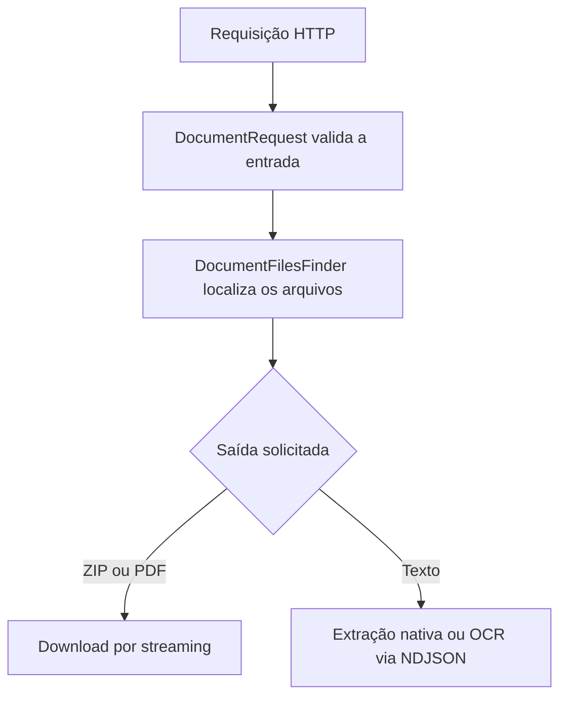

<div align="center">

# BaixaRI Backend

API em Node.js e TypeScript para consultar protocolos e certidões, gerar downloads em ZIP/PDF e extrair texto com OCR local.


[Frontend](https://github.com/marcosfrancomarinho/baixari) · [Endpoints](#endpoints) · [Execução](#instalação-e-execução)

</div>

## Sobre o projeto

O backend do **BaixaRI** consulta pastas de protocolos e certidões e entrega:

- **ZIP** com todos os arquivos encontrados;
- **PDF único** formado pelos PDFs e imagens existentes na pasta consultada;
- **texto progressivo** para o frontend gerar arquivos DOCX.

Quando um documento não possui texto nativo, a API renderiza a página e aplica OCR em português com Tesseract. O processamento é local e não depende de serviços externos.

A conversão de arquivos escolhidos pelo usuário em um PDF único pertence ao frontend e acontece diretamente no navegador. O backend não recebe uploads para essa funcionalidade.

## Funcionalidades

- consulta de protocolos e certidões pelo número;
- leitura recursiva de pastas e subpastas em ordem numérica;
- compactação ZIP por streaming;
- união dos PDFs e imagens armazenados no protocolo/certidão;
- extração de texto nativo de PDFs;
- OCR local de PDFs digitalizados, páginas mistas e imagens;
- resposta progressiva em `application/x-ndjson`;
- cancelamento do processamento quando o cliente encerra a conexão;
- estratégias independentes para as saídas ZIP e PDF;
- separação entre aplicação, infraestrutura e apresentação.

## Fluxo



## Endpoints

| Método | Rota | Retorno |
|---|---|---|
| `GET` | `/protocol/:number?format=zip` | protocolo compactado em ZIP |
| `GET` | `/protocol/:number?format=pdf` | protocolo reunido em um único PDF |
| `GET` | `/certificate/:number?format=zip` | certidão compactada em ZIP |
| `GET` | `/certificate/:number?format=pdf` | certidão reunida em um único PDF |
| `GET` | `/protocol/:number/text` | texto progressivo do protocolo |
| `GET` | `/certificate/:number/text` | texto progressivo da certidão |

## Organização

```text
src/
├── app/
│   ├── contracts/
│   ├── errors/
│   ├── factory/
│   ├── model/
│   ├── request/
│   ├── services/
│   ├── strategy/
│   └── usecase/
├── di/
├── infra/               # filesystem, ZIP, PDF e OCR
├── presentation/
│   ├── controllers/
│   ├── http/
│   └── routers/
└── main.ts
```

O guia [docs/code-organization.md](docs/code-organization.md) detalha as responsabilidades de cada camada.

## Configuração

Defina as pastas-base em `src/di/providers.ts`:

- `PATH_PROTOCOL`: diretório dos pedidos de protocolo;
- `PATH_CERTIFICATE`: diretório dos pedidos de certidão.

A porta pode ser definida pela variável de ambiente `PORT`; o padrão é `3000`.

Não é necessário Ghostscript para executar o backend.

## Instalação e execução

### Requisitos

- Node.js 22.13 ou superior;
- npm ou Yarn;
- acesso de leitura às pastas configuradas.

```bash
git clone https://github.com/marcosfrancomarinho/baixari-backend.git
cd baixari-backend
npm install
npm run dev
```

Para produção:

```bash
npm run build
npm start
```

## Scripts

| Comando | Descrição |
|---|---|
| `npm run dev` | inicia o servidor em desenvolvimento |
| `npm run build` | gera `dist/bundle.cjs` |
| `npm start` | executa o bundle de produção |
| `npm run type` | acompanha a verificação de tipos |

## Testes

```bash
node --import tsx --test tests/*.test.ts
npm run build
```

Os testes cobrem validação, localização de arquivos, downloads, PDF, OCR e streaming NDJSON.

## Observações

- A união de PDFs de protocolos/certidões gera um novo documento e não preserva assinaturas digitais dos arquivos originais.
- A precisão do OCR depende da resolução e da legibilidade da página.
- O conversor de arquivos locais está no frontend do BaixaRI.

## Licença

MIT.

## Autor

Desenvolvido por [Marcos Marinho](https://github.com/marcosfrancomarinho).
